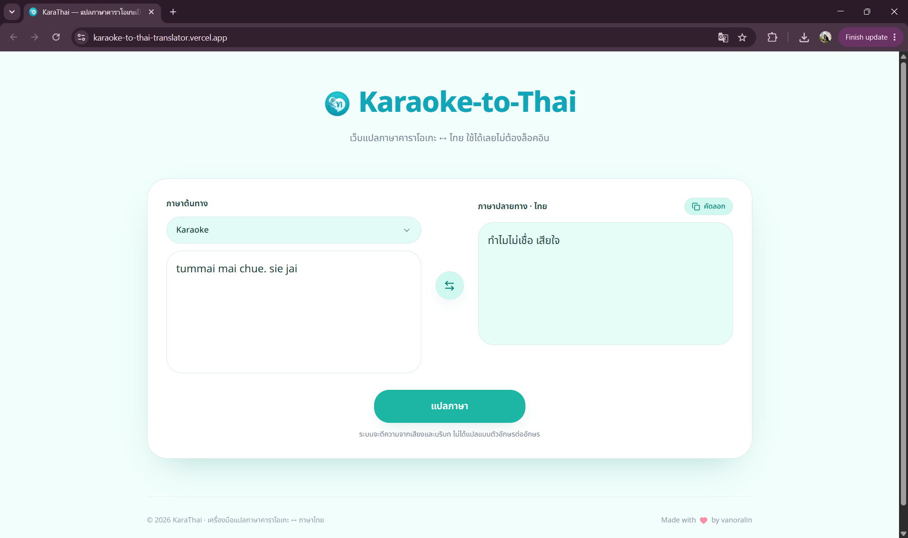

# 🇹🇭 KaraThai — Karaoke to Thai Translator

🌐 **Website Link:** [karaoke-to-thai-translator.vercel.app](https://karaoke-to-thai-translator.vercel.app/)

**KaraThai** is a free single-page web application designed to translate informal `Thai karaoke language` (Thai phonetics written in the Roman/English alphabet) into `natural Thai language`. Styled with a clean, responsive turquoise theme.



---

## ✨ Key Features

- 🧠 **AI-Powered Translations:** Seamlessly connects to OpenAI-compatible APIs (such as Google Gemini or OpenAI) to understand colloquialisms, slang, and context instead of simple letter-to-letter mapping (e.g., accurately translates `i guang non mak` to `ฉันง่วงนอนมาก`).
- ⚡ **Smart Offline Fallback:** If the API key is missing or fails, the app automatically switches to an offline phonetic dictionary and conversion rule engine, preventing crashes and keeping the service available.
- 🛡️ **IP & Prompt Privacy:** Protects your highly-tuned system prompts, endpoints, and credentials on the server side (via Environment Variables). Safe for publishing to public repositories on GitHub.
- 📈 **Built-in Analytics:** Integrated with **Google Analytics 4 (GA4)** to track user traffic and record click events (`click_translate`) for translation usage insights.

---

## 🛠️ Tech Stack

- **Framework:** [TanStack Start](https://tanstack.com/router/v1/docs/start/overview) (React-based SSR Framework)
- **Styling:** Tailwind CSS & Vanilla CSS
- **Server Engine:** Vinxi / Nitro Server (for secure server-side functions)
- **Icons:** Lucide React

---

## 💻 Local Setup & Development

1. **Clone the Repository & Install Dependencies:**
   ```bash
   git clone <your-repository-url>
   cd "kara-thai-flow-main"
   npm install
   ```

2. **Configure Environment Variables:**
   - Copy `.env.example` to create a `.env` file in the root folder:
   - Fill in your API endpoint, API key, model version, and Google Analytics ID:
   ```bash
   cp .env.example .env
   ```

3. **Run the Development Server:**
   ```bash
   npm run dev
   ```
   Open your browser to the URL displayed in the terminal (usually `http://localhost:3000`).

---

## 🚀 Deployment (Vercel)

When deploying this project to **Vercel**, ensure you configure the following in your project settings:
1. Add all the environment variables from your `.env` to Vercel's **Settings > Environment Variables**.
2. **Important:** Add the environment variable **`NITRO_PRESET=vercel`** to tell the Nitro bundler to build for Vercel Serverless/Edge instead of Cloudflare.
3. Redeploy the application and you're good to go!

---

## 📄 License

Distributed under the MIT License. See [LICENSE](LICENSE) for more information.

